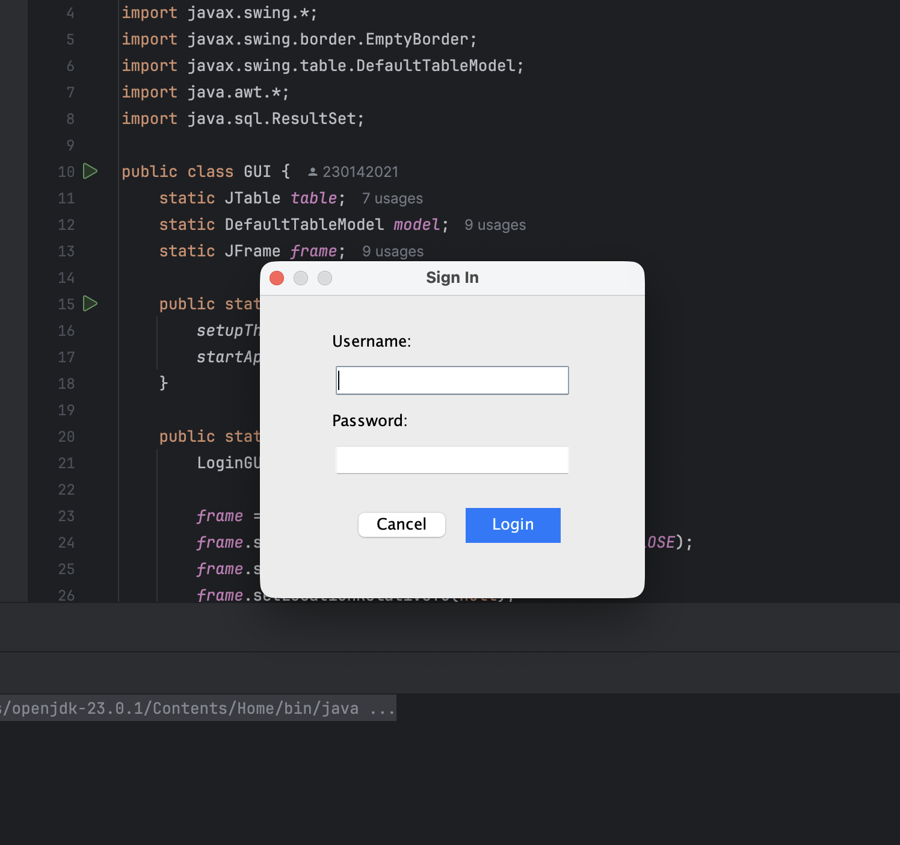
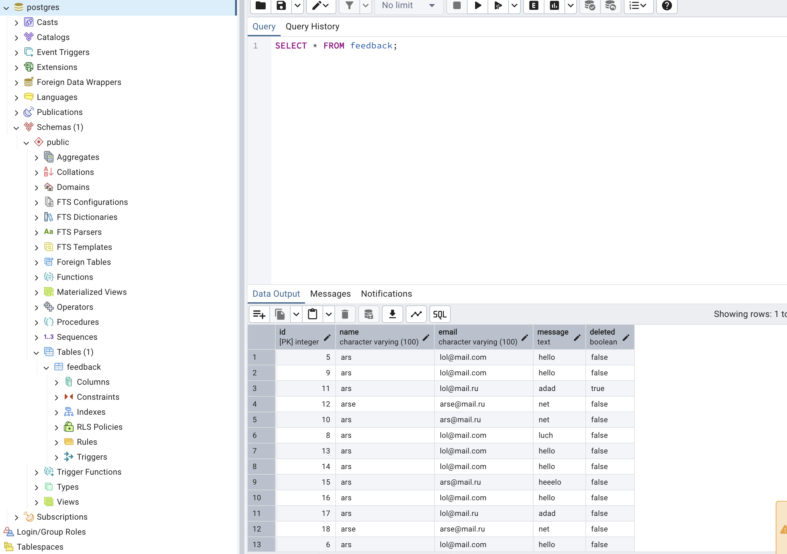

# 🚀 Feedback System PRO

## 📌 Project Overview
Final OOP project assignment. A professional desktop application for managing user feedback with role-based access and database persistence.

### 📽 Presentation
You can view the project presentation here: [Feedback System  - Canva Presentation](https://canva.link/4pjsvym0ozki8l2)

## 🖼 Screenshots

### 1. Authorization Window
Modern and compact login interface with role-based access control.


### 2. Main Dashboard
macOS-style responsive interface with full CRUD support and data table.


### 3. Database Management (pgAdmin)
Data persistence layer using PostgreSQL.


## 🧬 OOP Principles Demonstrated
- **Encapsulation:** Private fields and public getters/setters in models (`User`, `Feedback`).
- **Inheritance:** `Admin` class extends `User` class to share common attributes.
- **Polymorphism:** Overridden `showMenu()` method demonstrates dynamic method dispatch based on user roles.

## 🛠 Features
- **Full CRUD:** Create, Read, Update, and Soft-Delete feedback.
- **Role-Based Access:** Admin-only features (e.g., Delete button).
- **Trash Bin:** Recover deleted records or purge them permanently.
- **Data Persistence:** Integrated with PostgreSQL and supports CSV Export/Import.

## ⚙️ Setup & Requirements
- **Java:** JDK 17+
- **Database:** PostgreSQL (running on port 5433)
- **Library:** PostgreSQL JDBC Driver

### SQL Table Schema:
```sql
CREATE TABLE feedback (
    id SERIAL PRIMARY KEY,
    name VARCHAR(100),
    email VARCHAR(100),
    message TEXT,
    deleted BOOLEAN DEFAULT FALSE
);
