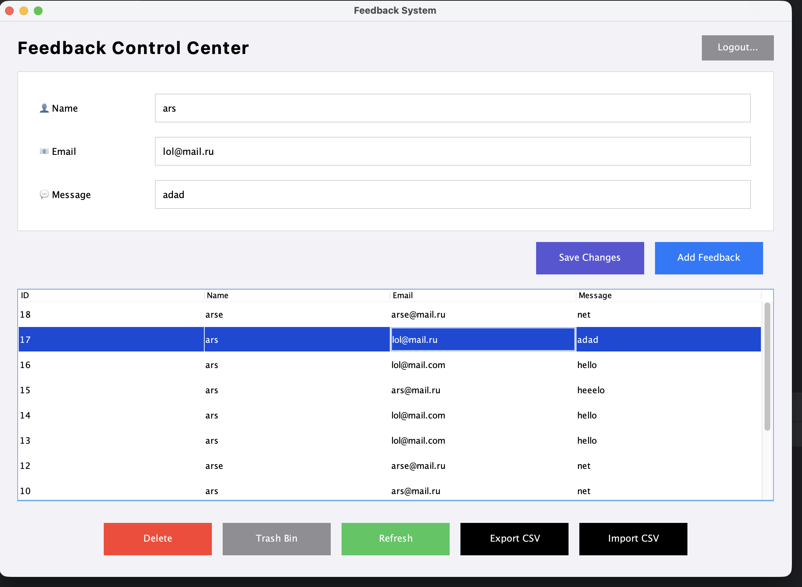

# 🚀 Feedback System 

## 📌 Project Overview
Final OOP project assignment. A professional desktop application for managing user feedback with role-based access and database persistence.

## 🖼 Screenshots

### 1. Authorization Window
Modern and compact login interface with role-based access control.


### 2. Main Dashboard
macOS-style responsive interface with full CRUD support and data table.


### 3. Database Management (pgAdmin)
Data persistence layer using PostgreSQL.


## 🧬 OOP Principles Demonstrated
- **Encapsulation:** Private fields and public getters/setters in models.
- **Inheritance:** `Admin` extends `User`.
- **Polymorphism:** Overridden `showMenu()` method for different user roles.

## ⚙️ Setup & Requirements
- **Java:** JDK 17+
- **Database:** PostgreSQL (port 5433)

### SQL Setup:
```sql
CREATE TABLE feedback (
    id SERIAL PRIMARY KEY,
    name VARCHAR(100),
    email VARCHAR(100),
    message TEXT,
    deleted BOOLEAN DEFAULT FALSE
);
Link to Presentation : https://canva.link/4pjsvym0ozki8l2
